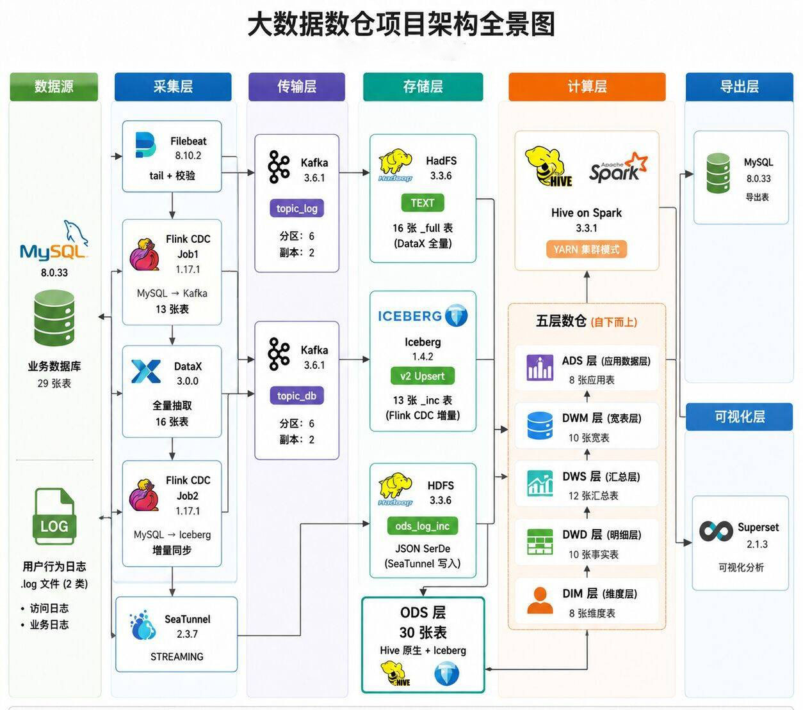
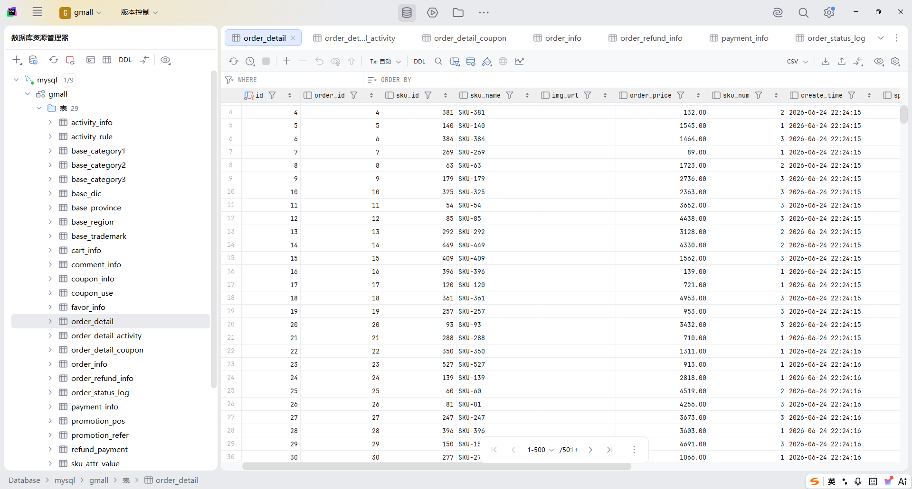
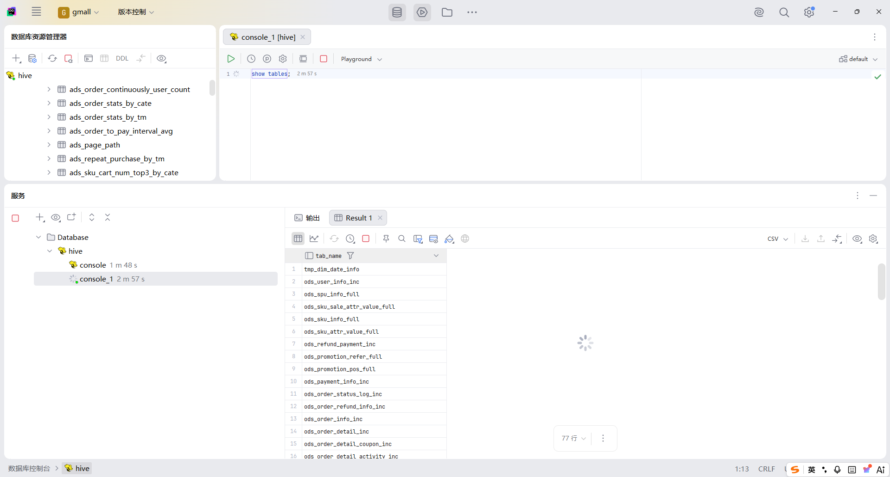
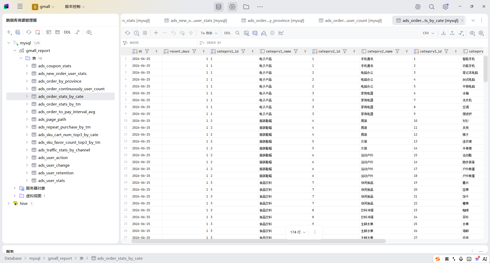

# 电商大数据离线+实时数仓

[]()
[]()
[]()
[]()
[]()

从 0 到 1 搭建的完整的全链路电商大数据离线+实时数仓项目。采用 **Hive on Spark** 计算引擎 + **Flink CDC** 增量同步 + **Apache Iceberg** 数据湖，基于维度建模构建 ODS → DIM → DWD → DWS → ADS 五层架构，最终通过 DolphinScheduler 实现全链路自动化调度。

> 3 台 CentOS 7.9 虚拟机 · 每台 5GB 内存 + 50GB 磁盘 · JDK 1.8 全链路兼容

---

## 架构全景



---

## 技术栈

| 类别 | 组件 | 版本 | 用途 |
|------|------|------|------|
| 存储 | Hadoop HDFS | 3.3.6 | 分布式文件系统 |
| 资源 | Hadoop YARN | 3.3.6 | 集群资源调度 |
| 计算 | Hive on Spark | 3.1.3 / 3.3.1 | 数仓 ETL 引擎 |
| 消息 | Kafka | 3.6.2 | 日志与 CDC 中转 |
| 同步 | Flink CDC | 2.3.0 | MySQL binlog 增量采集 |
| 流处理 | Flink | 1.15.4 | CDC Job on YARN |
| 数据湖 | Iceberg | 1.3.1 | v2 格式 Upsert 增量表 |
| 采集 | Filebeat | 7.17.24 | 日志实时采集 |
| 采集 | SeaTunnel | 2.3.13 | Kafka → HDFS 流式写入 |
| 同步 | DataX | v202309 | 全量同步 + 报表导出 |
| 调度 | DolphinScheduler | 3.1.9 | 每日工作流编排 |
| 可视化 | Superset | 2.1.3 | 业务指标仪表盘 |
| 协调 | ZooKeeper | 3.7.1 | 分布式协调服务 |

---

## 项目结构

```
├── doc/                                    
│   ├── 电商项目总文档.md
│   ├── 业务逻辑与数据字典.md
│   ├── 01.项目环境搭建.md
│   ├── 02.日志链路初始化及运行.md
│   ├── 03.ODS层业务数据全量同步.md
│   ├── 04.ODS层业务数据增量同步.md
│   ├── 05.DIM层维度表搭建.md
│   ├── 06.DWD层事务事实表搭建.md
│   ├── 07.DWS层汇总表搭建.md
│   ├── 08.ADS层应用报表搭建.md
│   ├── 09.ADS层数据导出.md
│   └── 10.DolphinScheduler工作流调度文档.md
├── sql/                                    
│   ├── gmall.sql                           # MySQL 原始 29 表 DDL
│   ├── ods/
│   │   ├── ods_full_tables_ddl.sql         # 16 张全量表建表
│   │   └── ods_inc_iceberg_ddl.sql         # 13 张 Iceberg 增量表建表
│   ├── cdc/
│   │   ├── cdc_job1.sql                    # Flink Job1: CDC → Kafka
│   │   └── cdc_job2.sql                    # Flink Job2: Kafka → Iceberg
│   ├── dim/
│   │   ├── dim_ddl.sql / dim_load_first.sql / dim_load_daily.sql
│   │   └── dim_date_data.txt               # 日期维度数据 (2025-2027)
│   ├── dwd/
│   │   └── dwd_ddl.sql / dwd_load_first.sql / dwd_load_daily.sql
│   ├── dws/
│   │   └── dws_ddl.sql / dws_load_first.sql / dws_load_daily.sql
│   └── ads/
│       └── ads_ddl.sql / ads_load_first.sql / ads_load_daily.sql
│       └── ads_mysql_ddl.sql               # MySQL gmall_report 建表
├── scripts/                                # 工具与管理脚本
│   ├── log_generator.py                    # 模拟行为日志生成
│   ├── log_pipeline.sh                     # 日志采集一键启动
│   ├── mysql_data_generator.py             # MySQL 模拟数据生成
│   ├── full_sync_pipeline.sh               # DataX 全量同步
│   ├── xsync / jpsall / myhadoop.sh        # 集群管理脚本
│   └── kf.sh / zk.sh                       # Kafka/ZK 启停脚本
└── datax-config-generator/                 # DataX 配置文件生成器
    ├── pom.xml                             # Maven 项目配置
    ├── configuration.properties            # 生成器参数
    └── src/                                # Java 源码
```

---

## 数据链路

### 链路一：用户行为日志（流式）

```
.log 文件 → Filebeat(tail + JSON校验) → Kafka(topic_log)
         → SeaTunnel(STREAMING) → HDFS /warehouse/gmall/ods/ods_log_inc/
```

- 页面日志 + 启动日志，嵌套 JSON 结构
- ODS 日志表使用 Hive **JsonSerDe**，STRUCT/ARRAY 自动解析
- 采集延迟 < 30 秒

### 链路二：业务数据（全量 + 增量双通道）

**全量通道（16 张维度/字典类表）：**
```
MySQL → DataX(mysqlreader + hdfswriter) → HDFS TEXT → Hive 原生表
```
- 每日凌晨覆盖写入 `dt=YYYY-MM-DD` 分区
- DolphinScheduler 调度，16 张表串行执行

**增量通道（13 张事实/事务类表）：**
```
MySQL binlog → Flink CDC Job1(CDC 2.3) → Kafka(topic_db, upsert-kafka)
             → Flink Job2 → Iceberg(v2 + Upsert, 13张_inc表)
```
- 首日 initial 模式自动全量快照，后续增量追 binlog
- upsert-kafka 中继层实现数据源解耦与故障隔离
- 同步延迟 < 5 秒

---

## 数仓分层

| 层级 | 表数 | 说明 |
|:---:|:---:|------|
| **ODS** | 30 | 16 全量 TEXT + 13 增量 Iceberg + 1 日志 JSON SerDe |
| **DIM** | 8 | 7 张全量快照维度 + 1 张用户拉链表 (SCD Type 2) |
| **DWD** | 10 | 6 事务事实 + 1 累积快照 + 1 周期快照 + 2 用户域 |
| **DWS** | 12 | 9 张 1d 日粒度 + 1 张 nd(7/30日) + 2 张 td(历史累积) |
| **ADS** | 16 | 流量/用户/商品/交易/优惠券五大主题报表 |
| **合计** | **76** | |

---

## 关键技术决策

### Hive on Spark 引擎架构

不使用 spark-sql，统一用 **hive CLI** 作为 SQL 入口，Hive 3.1.3 将执行计划翻译为 Spark Job 在 YARN 上运行。

- **原因**：spark-sql 内置 Hive 2.3 SerDe，与 Hive 3.1.3 创建的 TEXT 表不兼容
- **方案**：Spark 3.3.1 without-hadoop 纯净版，通过 `SPARK_DIST_CLASSPATH` 注入系统 Hadoop 类路径
- **引擎策略**：Iceberg 源表读取切 MapReduce，Hive 原生表用 Spark

### Flink CDC 双 Job + Kafka 中继

```
Job1: MySQL CDC → Kafka(upsert-kafka)     ← 13 个并行 Source
Job2: Kafka → Iceberg(Upsert v2)          ← 13 个并行 Sink
```

- **解耦**：CDC 挂了从 Kafka offset 恢复，不需要回扫 MySQL binlog
- **隔离**：两个 Job 的并行度、Checkpoint 间隔、内存独立调优

### 用户拉链表（SCD Type 2）

`dim_user_zip` 用 `start_date + end_date` 追踪用户信息历史变化：
- 首日：所有用户进 `dt=9999-12-31` 分区
- 每日：关旧链 + 开新链
- 查询当前：`WHERE end_date='9999-12-31'`
- 查询历史：`WHERE start_date<=目标日 AND end_date>目标日`

---

## 调度工作流

DolphinScheduler 每日凌晨 2:00 触发，7 个任务节点串并行：

```
datax_full_sync → dim → dwd → dws → ads → ads_export
                                        → iceberg_compact
```

| 任务 | 执行节点 | 超时 |
|------|:---:|:---:|
| DataX 全量同步 (16表) | hadoop101 | 2h |
| DIM 每日装载 | hadoop100 | 30min |
| DWD 每日装载 | hadoop100 | 1h |
| DWS 每日装载 | hadoop100 | 1h |
| ADS 每日装载 | hadoop100 | 1h |
| ADS→MySQL 导出 | hadoop101 | 30min |
| Iceberg Compaction | hadoop100 | 30min |

---

## 安装与运行

> doc目录下的文档记录了从头到尾的制作过程
```bash
# 1. 环境部署
# 参考 doc/01.项目环境搭建.md

# 2. 日志链路
# 参考 doc/02.日志链路初始化及运行.md

# 3. 数仓开发
# 参考doc/03-09

# 4. 首日装载
hive --hivevar dt=2026-06-25 -f sql/dim/dim_load_first.sql
hive --hivevar dt=2026-06-25 -f sql/dwd/dwd_load_first.sql
hive --hivevar dt=2026-06-25 -f sql/dws/dws_load_first.sql
hive --hivevar dt=2026-06-26 -f sql/ads/ads_load_first.sql

# 5. 每日调度（后续由 DolphinScheduler 自动执行）
hive --hivevar dt=$(date +%Y-%m-%d) -f sql/dim/dim_load_daily.sql
hive --hivevar dt=$(date +%Y-%m-%d) -f sql/dwd/dwd_load_daily.sql
hive --hivevar dt=$(date +%Y-%m-%d) -f sql/dws/dws_load_daily.sql
hive --hivevar dt=$(date +%Y-%m-%d) -f sql/ads/ads_load_daily.sql
```

---

## 节点规划

| 节点 | 主机名 | 常驻进程 |
|------|--------|---------|
| 节点1 | hadoop100 | NameNode, DataNode, NodeManager, ZK, Kafka, **Hive Metastore**, **Spark/Flink Client** |
| 节点2 | hadoop101 | DataNode, **ResourceManager**, NodeManager, ZK, Kafka, **MySQL**, Filebeat, SeaTunnel, DataX |
| 节点3 | hadoop102 | SecondaryNameNode, DataNode, NodeManager, ZK, Kafka, **DolphinScheduler**, Superset |

---

## 项目截图

### MySQL业务库数据



### 数仓分层表一览
> 76 张表覆盖 ODS(30) + DIM(8) + DWD(10) + DWS(12) + ADS(16)



### ADS 报表导出至 MySQL
> DataX 每日凌晨将 ADS 16 张报表导出至 gmall_report 库


---

## 性能指标

| 指标 | 数值 |
|------|------|
| 总表数 | 76 张（ODS 30 + DW 46） |
| SQL 总行数 | 12,000+ |
| 日志采集延迟 | < 30s |
| CDC 同步延迟 | < 5s |
| 每日 ETL 耗时 | ≈ 2h |
| 产出业务指标 | 30+ |
| 组件数 | 12，全部 JDK 1.8 兼容 |
